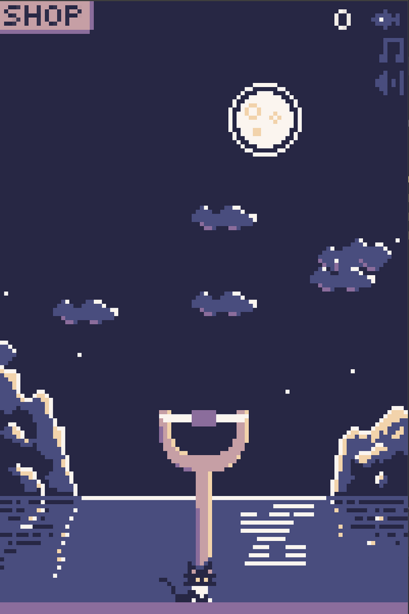

# Catapult Game
 
The initial commit is a copy of [@Deep-fold's repo for CatapultGame](https://github.com/Deep-Fold/CatapultGame).
@Deep-fold's CatapultGame was submitted for github Game Off 2020, playable on itch.io [here](https://deep-fold.itch.io/catapult). 
It's a really cute game.

Credits:
 Catapult @Deep-fold (https://github.com/Deep-Fold/CatapultGame)
 Licensed under Creative Commons: By Attribution-NonCommercial 3.0 Unported (CC BY-NC 3.0)
 https://creativecommons.org/licenses/by-nc/3.0/

Wagon wheel Kevin MacLeod (incompetech.com)
 Licensed under Creative Commons: By Attribution 3.0
 http://creativecommons.org/licenses/by/3.0

Mellowtron Kevin MacLeod (incompetech.com)
 Licensed under Creative Commons: By Attribution 3.0
 http://creativecommons.org/licenses/by/3.0/

## Planned future experiments/developments
1. Scaling up end goal and power-ups
1. Persistence across games (No idea how but would be awesome to have)

With no experience in game dev, I am looking forward to learn some knowledge and apply them directly
through this project. Thanks once again to @Deep-fold for the opportunity. 
